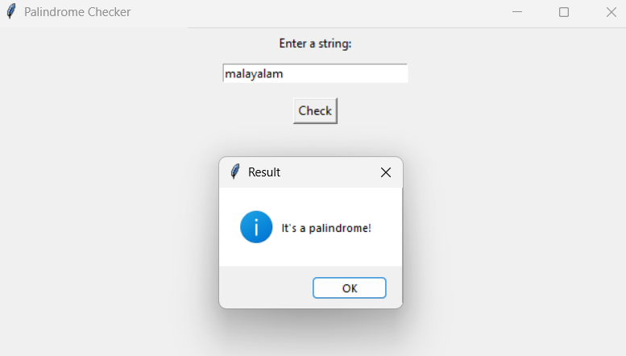

 


# Palindrome Checker

## 🛠️ Description

This open-source project contains a strict palindrome checker built using Python's `tkinter` module. The checker evaluates user input and determines if it is a **strict palindrome**, meaning it is **case-sensitive**, **space-sensitive**, and **punctuation-sensitive**.

If you want, you can get the Python files and edit them as you want. Feel free to contribute to this repository. You can:
1. Improve functionality  
2. Fix a bug  
3. Or add a new cool feature  

Try to contribute as much as you can. Even a small contribution is enough.

## ⚙️ Languages or Frameworks Used

- Python  
- Tkinter (built-in module – no installation required)

No external libraries are needed. This project runs on standard Python 3.x installations.

## 🌟 How to run

You can type this command on your terminal to run the script:

```bash
python Palindrome/palindrome.py
````

If this doesn't work, try:

```bash
python3 Palindrome/palindrome.py
```

To stop it you can press `CTRL + C`.

## 📺 Demo

**1️⃣ Input is *not* a palindrome due to whitespace sensitivity (e.g., `"A man a plan a canal Panama"`):**


**2️⃣ Input *is* a strict palindrome (e.g., `"madam"`):**



## 🤖 Author

This script is by AshnaParveen.

GitHub: [AshnaParveen](https://github.com/AshnaParveen)


